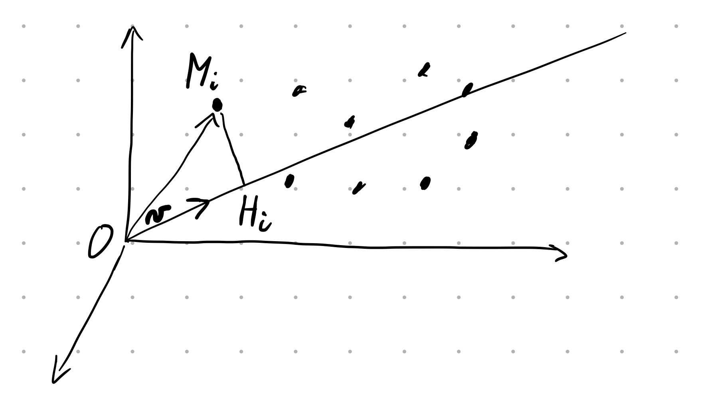

```{r, include=FALSE}
source("05_presentation_svd.R", local = knitr::knit_global())
```

# Géométrie d'un tableau de données

- $\mathbf{X} \in \mathbb{R}^{n \times p}$ ; $x_{ij} \in \mathbb{R}$
- Nuage de $n$ points $\mathbf{x_i}$ dans $\mathbb{R}^p$
- Nuage de $p$ points $\mathbf{x_j}$ dans $\mathbb{R}^n$
- Projeter le nuage des points $\mathbf{x_i}$ sur $\mathcal{H} \subset \mathbb{R}^p$
- Minimiser les déformations

# Meilleur sous-espace de dimension $1$

```{r, out.width = "250px", echo=FALSE}

```

- $\mathcal{H}$ une droite de vecteur unitaire $\mathbf{v}$ ($\mathbf{v}^T\mathbf{v}=1$)
- $M_i$ le point de $\mathbb{R}^p$ tel que $\mathbf{x_i} = \mathbf{OM_i}$
- $H_i$ la projection de $M_i$ sur $\mathcal{H}$ : $OH_i = \mathbf{x_i}^T\mathbf{v}$
- $\mathcal{H}$ minimise $\sum_i M_i H_i^2 \quad = \quad \sum_i OM_i^2 - \sum_i OH_i^2$
- $\mathcal{H}$ maximise $\sum_i OH_i^2 = (\mathbf{X}\mathbf{v})^T(\mathbf{X}\mathbf{v}) = \mathbf{v}^T \mathbf{X}^T \mathbf{X} \mathbf{v}$

# Meilleur sous-espace de dimension $k$

- $\mathcal{H}_1$ contient $\mathbf{v_1}$ qui maximise $\mathbf{v_1}^T \mathbf{X}^T \mathbf{X} \mathbf{v_1}$
- $\mathcal{H}_2$ contient $\mathbf{v_1}$ et $\mathbf{v_2}$
- $\mathbf{v_2}$ orthogonal à $\mathbf{v_1}$ et maximise $\mathbf{v_2}^T \mathbf{X}^T \mathbf{X} \mathbf{v_2}$
- $\mathbf{X}^T \mathbf{X} \mathbf{v_1} = \lambda_1 \mathbf{v_1}$ avec $\lambda_1$ la plus grande valeur propre
- $\mathbf{X}^T \mathbf{X} \mathbf{v_2} = \lambda_2 \mathbf{v_2}$ avec $\lambda_2$ la seconde plus grande valeur propre
- $\mathbf{v_1}, \mathbf{v_2},\dots \mathbf{v_k}$ forment une base de $\mathcal{H}_k$
- La projection du nuage des $n$ points $\mathbf{x_i}$ sur $\mathcal{H}_k$ minimise les carrés des écarts à $\mathbb{R}^p$
- Symétriquement pour les vecteurs $\mathbf{u_1}, \mathbf{u_2},\dots \mathbf{u_k}$, etc.

# Décomposition en valeurs singulières

\begin{equation*}
\begin{cases}
\mathbf{X}^T\mathbf{X}\mathbf{v_\alpha} = \lambda_\alpha \mathbf{v_\alpha} \\
\mathbf{X}\mathbf{X}^T\mathbf{u_\alpha} = \mu_\alpha \mathbf{u_\alpha}
\end{cases}
\label{eq:svd-meme-valeurs-propres}
\end{equation*}

- $\left(\mathbf{X}\mathbf{X}^T\right)\mathbf{X}\mathbf{v_\alpha} = \lambda_\alpha \left(\mathbf{X}\mathbf{v_\alpha}\right) \Rightarrow \lambda_\alpha \leq \mu_\alpha$
- $\left(\mathbf{X}^T\mathbf{X}\right)\mathbf{X}^T\mathbf{u_\alpha} = \mu_\alpha \left(\mathbf{X}^T\mathbf{u_\alpha}\right) \Rightarrow \mu_\alpha \leq \lambda_\alpha$
- $\lambda_\alpha = \mu_\alpha$
- $\|\mathbf{X}\mathbf{v_\alpha}\|_2 = \sqrt{\lambda_\alpha}$
- $\mathbf{u_\alpha} = \frac{1}{\sqrt{\lambda_\alpha}} \mathbf{Xv_\alpha}$ et $\mathbf{v_\alpha} = \frac{1}{\sqrt{\lambda_\alpha}} \mathbf{X}^T\mathbf{u_\alpha}$
- $\mathbf{X}\mathbf{v_\alpha}=\mathbf{u_\alpha}\sqrt{\lambda_\alpha} \Rightarrow \mathbf{X}\left(\sum_{\alpha=1}^{P}\mathbf{v_\alpha}\mathbf{v_\alpha}^T\right) = \sum_{\alpha=1}^{P}\sqrt{\lambda_\alpha}\mathbf{u_\alpha}\mathbf{v_\alpha}^T$

$$\mathbf{X} = \sum_{\alpha=1}^{P}\sqrt{\lambda_\alpha}\mathbf{u_\alpha}\mathbf{v_\alpha}^T \quad \equiv \quad \mathbf{X} = \mathbf{U} \mathbf{D} \mathbf{V}^T$$

# Réduction dimensionnelle / Compression

```{r, out.width = "200px", echo=FALSE}

```

---

```{r, warning=FALSE, echo=FALSE}
X <- read_grey_img("images/hortensia.pgm")

par(mfrow=c(1,2), oma=c(1,1,0,0)+0.1, mar=c(0,0,1,1)+0.1);
print_grey_img(X, main="image originale d=256", asp=1);
print_grey_img(compress_SVD(X,16), main="d=16", asp=1);
```

---

```{r, warning=FALSE, echo=FALSE}
par(mfrow=c(1,2), oma=c(1,1,0,0)+0.1, mar=c(0,0,1,1)+0.1);
print_grey_img(compress_SVD(X,32), main="d=32", asp=1);
print_grey_img(compress_SVD(X,64), main="d=64", asp=1);
```

---

```{r, warning=FALSE, echo=FALSE}
par(mfrow=c(1,2), oma=c(1,1,0,0)+0.1, mar=c(0,0,1,1)+0.1);
print_grey_img(compress_SVD(X,128), main="d=128", asp=1);
print_grey_img(compress_SVD(X,256), main="d=256", asp=1);
```