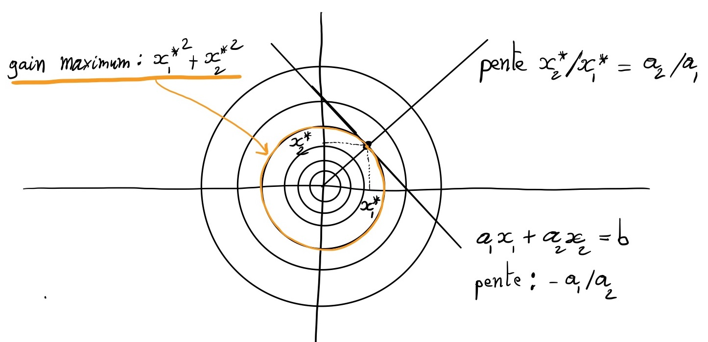

# Optimisation sous contraintes et multiplicateurs de Lagrange

Avant de pouvoir présenter la preuve de l'existence de la décomposition en valeurs singulières, nous devons introduire une stratégie souvent très utile pour résoudre un problème d'optimisation sous contraintes : la méthode dite des multiplicateurs de Lagrange.

Prenons un exemple simple à deux dimensions. Nous cherchons à maximiser $F(\mathbf{x}) = x_1^2 + x_2^2$ sous la contrainte $K(\mathbf{x})=b$, avec $K(\mathbf{x}) = a_1 x_1 + a_2 x_2$. C'est-à-dire que le point solution $\mathbf{x^*}$ doit être situé sur la ligne $K$.

Sur cet exemple, les lignes de niveaux, ou contours, de $F$ sont des cercles centrés sur l'origine du repère cartésien.
La solution $\mathbf{x*}$ appartient au contour de $F$ tangent à la contrainte $K$. Il faut donc que leurs gradients soient alignés : $\nabla F = \lambda \nabla K$.

\[
\nabla F =
\left( \begin{array}{c}
\partial F / \partial x_1 \\
\partial F / \partial x_2
\end{array} \right)
=
\left( \begin{array}{c}
2 x_1 \\
2 x_2
\end{array} \right)
\quad ; \quad
\nabla K =
\left( \begin{array}{c}
\partial K / \partial x_1 \\
\partial K / \partial x_2
\end{array} \right)
=
\left( \begin{array}{c}
a_1 \\
a_2
\end{array} \right)
\]
Nous avons donc un système de trois équations à trois inconnues ($x_1$, $x_2$ et $\lambda$) :

\[
\begin{cases}
2 x_1 = \lambda a_1 \\
2 x_2 = \lambda a_2 \\
a_1 x_1 + a_2 x_2 = b
\end{cases}
\]

En résolvant ce système par simples substitutions, nous trouvons la solution :

\[
\begin{cases}
x_1^* = \frac{a_1 b}{a_1^2 + a_2^2} \\
x_2^* = \frac{a_2 b}{a_1^2 + a_2^2} \\
\lambda^* = \frac{2b}{a_1^2 + a_2^2}
\end{cases}
\]
Ce même calcul s'écrit d'une façon plus systématique en rassemblant les équations $\nabla F = \lambda \nabla K$ et $K(\mathbf{x})=b$ par l'introduction du Lagrangien :

\[
\mathcal{L}(\mathbf{x},\lambda) = F(\mathbf{x}) - \lambda(K(\mathbf{x})-b)
\]

En effet, en annulant les dérivées partielles de $\mathcal{L}$, nous retrouvons les équations $\nabla F = \lambda \nabla K$ et $K(\mathbf{x})=b$ :

\[
\begin{array}{lll}
\partial \mathcal{L} / \partial x_1 = 0 &\Leftrightarrow &\partial F / \partial x_1 = \lambda \partial K / \partial x_1\\
\partial \mathcal{L} / \partial x_2 = 0 &\Leftrightarrow &\partial F / \partial x_2 = \lambda \partial K / \partial x_2\\
\partial \mathcal{L} / \partial \lambda = 0 &\Leftrightarrow &K(\mathbf{x}) = b\\
\end{array}
\]

Ainsi, le problème d'optimisation sous contrainte exprimé en fonction de $F$ et $K$ peut s'écrire comme un problème d'optimisation non contraint, en fonction de $\mathcal{L}$, dans un espace de plus grande dimension que celui d'origine puisque s'ajoute aux dimensions de $\mathbf{x}$ celle de $\lambda$.