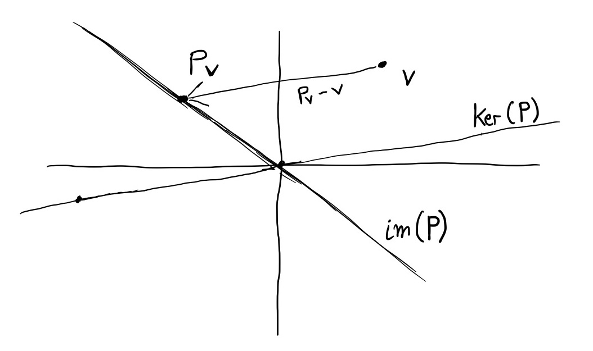
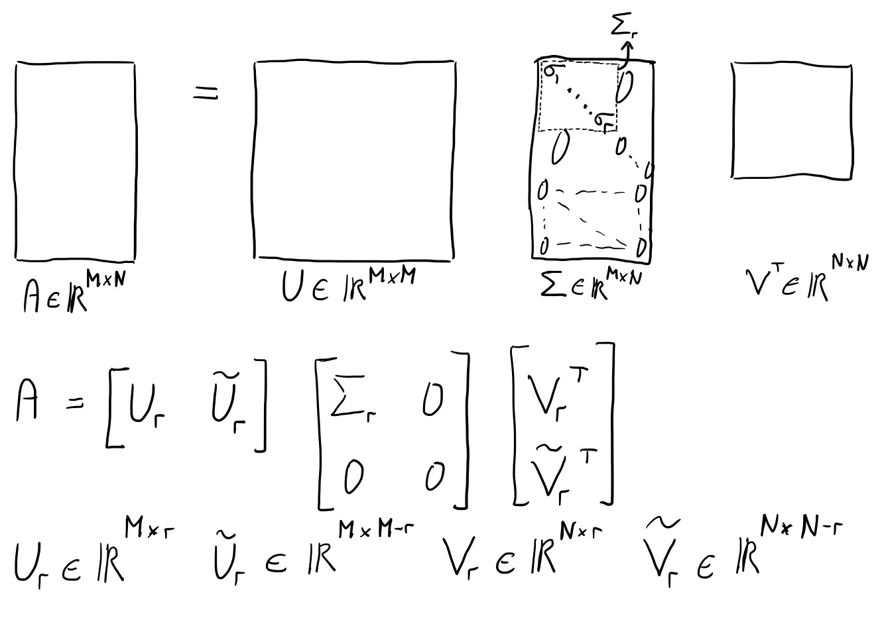

# Projecteurs orthogonaux et SVD

Nous introduisons la notion de projecteur et nous montrons son lien avec la décomposition en valeurs signulières (SVD). Ainsi, nous comprendrons mieux la géométrie du SVD et nous serons plus tard en mesure de construire un algorithme qui est une extension de la méthode de la puissance itérée pour le calcul des $k$ premières valeurs singulières et vecteurs singuliers.

## Projecteur

Un projecteur est une matrice carrée idempotente : $\mathbf{P}^2=\mathbf{P}$. Rappelons que l'espace des colonnes de $\mathbf{P}$ formé de l'ensemble des vecteurs qui s'expriment comme une combinaison linéaire des colonnes de $\mathbf{P}$, c'est-à-dire tous les vecteurs $\mathbf{v}$ qui s'écrivent sous la forme $\mathbf{P}\mathbf{x}$. L'espace des colonnes de $\mathbf{P}$ est également appelé l'image de $\mathbf{P}$ et se note $Im(\mathbf{P})$. Un vecteur $\mathbf{v}$ qui appartient à l'image d'un projecteur $\mathbf{P}$ est tel que $\mathbf{P}\mathbf{v}=\mathbf{P}$ :

\begin{align*}
 & \mathbf{v} \text{appartient à l'image de $\mathbf{P}$} \\
= \{& \text{Par définition de l'image d'une transformation linéaire.} \} \\
 & \mathbf{v} = \mathbf{P}\mathbf{x} \\
= \{& \text{Multiplication des deux membres de l'égalité par $\mathbf{P}$} \} \\
 & \mathbf{P}\mathbf{v} = \mathbf{P^2}\mathbf{x} \\
= \{& \text{Idempotence d'un projecteur.} \} \\
 & \mathbf{P}\mathbf{v} = \mathbf{P}\mathbf{x} \\
= \{& \mathbf{v} = \mathbf{P}\mathbf{x} \} \\
 & \mathbf{P}\mathbf{v} = \mathbf{v} \\
\end{align*}

On appelle noyau d'une transformation linéaire, l'ensemble des vecteurs que cette dernière transforme en $\mathbf{0}$, c'est-à-dire les vecteurs qui montrent une dépendance linéaire entre des colonnes de la représentation matricielle de la transformation. Dans le cas d'un projecteur $\mathbf{P}$, la projection sur l'image de $\mathbf{P}$ d'un vecteur $\mathbf{v}$ se fait selon la direction $\mathbf{P}\mathbf{v}-\mathbf{v}$ qui appartient au noyau de $\mathbf{P}$ noté $Ker(\mathbf{P})$ (voir la figure \@ref(fig:projecteur)) :
\[
\mathbf{P}(\mathbf{P}\mathbf{v}-\mathbf{v}) = \mathbf{P}^2\mathbf{v}-\mathbf{P}\mathbf{v} = \mathbf{P}\mathbf{v}-\mathbf{P}\mathbf{v} = \mathbf{0}
\]

```{r projecteur, fig.cap= "Schéma d'un projecteur", echo=FALSE}

```

Le projecteur complémentaire à $\mathbf{P}$ est $\mathbf{I-P}$, il projette sur le noyau de $\mathbf{P}$. C'est-à-dire que $Im(\mathbf{I-P})=Ker(\mathbf{P})$. En effet :

\begin{align*}
 & \mathbf{v} \in Ker(\mathbf{P}) \\
= \{& \text{Par définition du noyau} \} \\
 & \mathbf{P}\mathbf{v} = \mathbf{0} \\
\Rightarrow \phantom{\{}& \\
 & (\mathbf{I-P})\mathbf{v} = \mathbf{v} \\
= \{& \text{Par définition de l'image} \} \\
 & \mathbf{v} \in Im(\mathbf{I-P}) \\
\end{align*}

Donc, $Ker(\mathbf{P}) \subseteq Im(\mathbf{I-P})$. Par ailleurs, un élément de l'image de $\mathbf{I-P}$ peut se noter $(\mathbf{I-P})\mathbf{v}$, ce qui est égal à $\mathbf{v}-\mathbf{Pv}$ et appartient donc au noyau de $\mathbf{P}$. Donc, nous avons aussi $Im(\mathbf{I-P}) \subseteq Ker(\mathbf{P})$. Ainsi : $Ker(\mathbf{P}) = Im(\mathbf{I-P})$ (de même : $Ker(\mathbf{I-P}) = Im(\mathbf{P})$).

Donc, un projecteur $\mathbf{P}$ sépare l'espace initial en deux sous-espaces $S1 = Im(\mathbf{P})$ et $S2 = Ker(\mathbf{P})$. $\mathbf{P}$ projette **sur** $S1$ **parallèlement à** (ou **le long de**) $S2$.

## Projecteur orthogonal

Un projecteur est dit orthogonal quand $S1$ et $S2$ sont orthogonaux. Montrons qu'une projection $\mathbf{P}$ est orthogonale si et seulement si $\mathbf{P}=\mathbf{P}^T$. Montrons d'abord que $\mathbf{P}=\mathbf{P}^T \Rightarrow \text{orthogonalité}$.

\begin{align*}
 & (\mathbf{Px})^T(\mathbf{I-P})\mathbf{y} \quad \text{pour tout $\mathbf{x}$ et $\mathbf{y}$} \\
= \{& \text{Propriété de la transposition.} \} \\
 & \mathbf{x}^T\mathbf{P}^T(\mathbf{I-P})\mathbf{y} \\
= \{& \mathbf{P}=\mathbf{P}^T \} \\
 & \mathbf{x}(\mathbf{P}-\mathbf{P}^2)\mathbf{y} \\
= \{& \mathbf{P} \text{ est un projecteur donc } \mathbf{P}=\mathbf{P}^2\} \\
 & 0
\end{align*}

Montrons ensuite que $\text{orthogonalité} \Rightarrow \mathbf{P}=\mathbf{P}^T$. $\mathbf{P}$ projette sur $S1$ le long de $S2$ avec $S1 \bot S2$. Soit $\{\mathbf{q_1}, \mathbf{q_2}, \dots, \mathbf{q_n}\}$ une base orthonormale de $S1$ et $\{\mathbf{q_{n+1}}, \mathbf{q_{n+2}}, \dots, \mathbf{q_m}\}$ une base de $S2$. Soit $Q$ la matrice orthogonale dont la jème colonne est $\mathbf{q_j}$. Nous avons : $\mathbf{PQ} = (\mathbf{q_1}, \mathbf{q_2}, \dots, \mathbf{q_n}, 0, \dots, 0)$. Donc, $\mathbf{Q^TPQ} = diag(1, 1, \dots, 1, 0, \dots, 0)=\mathbf{\Sigma}$. Ainsi, $\mathbf{P} = \mathbf{Q\Sigma Q^T} = \mathbf{P}^T$.

Etant donné un vecteur unitaire $\mathbf{q}$. Le projecteur orthogonal sur l'espace à une dimension défini par $\mathbf{q}$ est la matrice de rang 1 $\mathbf{P_q}=\mathbf{q}\mathbf{q}^T$. Le projecteur complémentaire est $\mathbf{P_{\bot q}}=\mathbf{I}-\mathbf{P_q}$ de rang $m-1$ (si $\mathbf{q}$ est de dimension $m$).

Pour toute matrice $\mathbf{Q} \in \mathbb{R}^{M \times N}$ dont les colonnes $\mathbf{q_j}$ sont orthonormales, $\mathbf{P}=\mathbf{QQ^T}=\sum \mathbf{q_j}\mathbf{q_j}^T$ est un projecteur orthogonal sur $Im(\mathbf{Q})$.

Rappelons la décomposition en valeurs singulière d'une matrice $\mathbf{A} \in \mathbb{R}^{M \times N}$ de rang $r$ : $\mathbf{A} = \mathbf{U} \mathbf{\Sigma}\mathbf{V}^T$ avec $\mathbf{U} \in \mathbb{R}^{M \times M}$, $\mathbf{V} \in \mathbb{R}^{N \times N}$ des matrices aux colonnes orthonormales et $\mathbf{\Sigma}=diag(\sigma_1,\dots,\sigma_r) \in \mathbb{R}^{M \times N}$. Nous pouvons partitionner le SVD en blocs pour obtenir la forme réduite présentée sur la figure \@ref(fig:svdreduit).

```{r svdreduit, fig.cap= "SVD réduit", echo=FALSE}

```

Nous avons les propriétés fondamentales suivantes :

\begin{align*}
Im(\mathbf{A}) &= Im(\mathbf{U_r}) & \mathbf{U_r}\mathbf{U_r}^T &: \text{ est un projecteur orthogonal sur } Im(\mathbf{A}) \\
Ker(\mathbf{A}) &= Im(\tilde{\mathbf{V_r}}) & \tilde{\mathbf{V_r}}\tilde{\mathbf{V_r}}^T &: \text{ est un projecteur orthogonal sur } Ker(\mathbf{A}) \\
Im(\mathbf{A}^T) &= Im(\mathbf{V_r}) & \mathbf{V_r}\mathbf{V_r}^T &: \text{ est un projecteur orthogonal sur } Im(\mathbf{A}^T) \\
Ker(\mathbf{A}^T) &= Im(\tilde{\mathbf{U_r}}) & \tilde{\mathbf{U_r}}\tilde{\mathbf{U_r}}^T &: \text{ est un projecteur orthogonal sur } Ker(\mathbf{A}^T) \\
\end{align*}

Montrons par exemple que $Ker(\mathbf{A})=Im(\tilde{\mathbf{V_r}})$, c'est-à-dire que les $N-r$ dernières colonnes de $\tilde{\mathbf{V_r}}$ forment une base orthonormale pour le noyau de $\mathbf{A}$, c'est-à-dire pour l'ensemble des vecteurs $\mathbf{x}$ tels que $\mathbf{A}\mathbf{x}=0$.

Considérons $\mathbf{x} \in Im(\tilde{\mathbf{V_r}})$, ce vecteur s'écrit sous la forme $\mathbf{x} = \sum_{i=r+1}^{N}w_i\mathbf{v_i}$ avec $w_i \in \mathbb{R}$ et $\mathbf{v_i}$ la i-ème colonne de $\tilde{\mathbf{V_r}}$. Nous devons montrer que $\mathbf{A}\mathbf{x}=0$.

\begin{align*}
 & \mathbf{A}\mathbf{x} \\
= \{& \text{Par définition de $\mathbf{x}$.} \} \\
 & \mathbf{A}\sum_{i=r+1}^{N}w_i\mathbf{v_i} \\
= \{& \text{Par linéarité.} \} \\
 & \sum_{i=r+1}^{N}w_i(\mathbf{A}\mathbf{v_i}) \\
\end{align*}

Il suffit donc de montrer que chaque $\mathbf{A}\mathbf{v_i}$ est nul.

\begin{align*}
 & \mathbf{A}\mathbf{v_i} \\
= \{& \text{SVD de $\mathbf{A}$} \} \\
 & (\mathbf{U}\mathbf{\Sigma}\mathbf{V}^T) \mathbf{v_i} \\
= \{& \text{Les colonnes de $\mathbf{V}$ sont orthonormales et $\mathbf{v_i}$ est une colonne de $\mathbf{V}$.} \\
\phantom{=}\phantom{\{}& \text{Donc $\mathbf{V}^T \mathbf{v_i} = \mathbf{e_i}$ le vecteur avec des 0 partout sauf le 1 en position $i$.} \} \\
 & \mathbf{U}\mathbf{\Sigma}\mathbf{e_i} \\
= \{& \mathbf{\Sigma}\mathbf{e_i} = 0 \text{ car à partir de la (r+1)ème ligne, toutes les lignes de $\mathbf{\Sigma}$ sont nulles et $i \geq r+1$.} \} \\
 & 0 \\
\end{align*}

## Projection sur une base quelconque

Nous cherchons à projeter un vecteur $\mathbf{v}$ sur l'espace des colonnes d'une matrice $\mathbf{A}$. Notons le résultat de cette projection $\mathbf{y} \in  Im(\mathbf{A})$. $\mathbf{y}-\mathbf{v}$ est orthogonal à $Im(\mathbf{A})$ (c'est-à-dire qu'il appartient à $Ker(\mathbf{A})$). Autrement dit, en posant $\mathbf{y}=\mathbf{A}\mathbf{x}$, nous avons :

\begin{align*}
 & \mathbf{a_j}^T (\mathbf{y}-\mathbf{v}) = 0, \forall j \\
= \{& \text{Posons $\mathbf{y}=\mathbf{A}\mathbf{x}$.} \} \\
 & \mathbf{a_j}^T (\mathbf{A}\mathbf{x}-\mathbf{v}) = 0, \forall j \\
= \{& \text{Linéarité de la multiplication matricielle.} \} \\
 & \mathbf{A}^T (\mathbf{A}\mathbf{x}-\mathbf{v}) = \mathbf{0} \\
= \phantom{\{}& \\
 & \mathbf{A}^T\mathbf{A}\mathbf{x} = \mathbf{A}^T\mathbf{v} \\
= \{& \text{Si $\mathbf{A}^T\mathbf{A}$ est inversible.} \} \\
 & \mathbf{x} = (\mathbf{A}^T\mathbf{A})^{-1}\mathbf{A}^T\mathbf{v} \\
\end{align*}

Ainsi, la projection $\mathbf{y} = \mathbf{A}\mathbf{x} = \mathbf{A}(\mathbf{A}^T\mathbf{A})^{-1}\mathbf{A}^T\mathbf{v}$. Nous trouvons donc que $\mathbf{A}(\mathbf{A}^T\mathbf{A})^{-1}\mathbf{A}^T$ est un projecteur orthogonal sur l'espace des colonnes de $\mathbf{A}$. En fait, il est simple de vérifier que ce projecteur est $\mathbf{U_r}\mathbf{U_r}^T$ :

\begin{align*}
\mathbf{A} &= \mathbf{U_r}\mathbf{\Sigma_r}\mathbf{V_r}^T \\
\mathbf{A}^T &= \mathbf{V_r}\mathbf{\Sigma_r}\mathbf{U_r}^T \\
\mathbf{A}^T\mathbf{A} &= \mathbf{V_r}\mathbf{\Sigma_r}^2\mathbf{V_r}^T \\
(\mathbf{A}^T\mathbf{A})^{-1} &= \mathbf{V_r}\mathbf{\Sigma_r}^{-2}\mathbf{V_r}^T \\
(\mathbf{A}^T\mathbf{A})^{-1}\mathbf{A}^T &= \mathbf{V_r}\mathbf{\Sigma_r}^{-1}\mathbf{U_r}^T \\
\mathbf{A}(\mathbf{A}^T\mathbf{A})^{-1}\mathbf{A}^T &= \mathbf{U_r}\mathbf{U_r}^T \\
\end{align*}