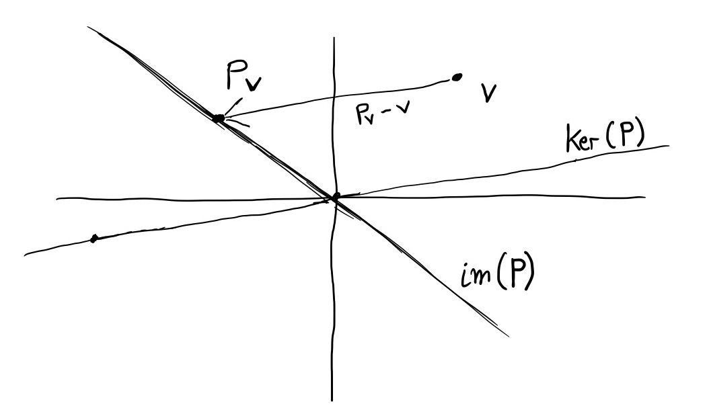
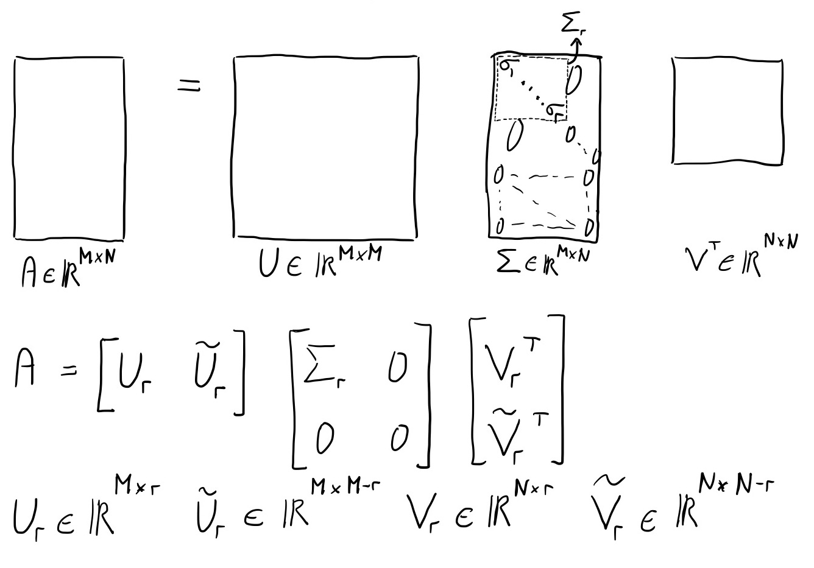

# Projecteur

- $\mathbf{P}^2=\mathbf{P}$
- $\mathbf{P}^2=\mathbf{P}$ et $\mathbf{P}=\mathbf{P}^T$, alors $Im(\mathbf{P}) \perp Ker(\mathbf{P})$ (proj. orthogonal)

```{r, out.width = "300px", echo=FALSE}

```

# SVD Réduit

```{r, out.width = "300px", echo=FALSE}

```

# SVD réduit et projecteurs orthogonaux

\begin{align*}
Im(\mathbf{A}) &= Im(\mathbf{U_r}) & \mathbf{U_r}\mathbf{U_r}^T &: \text{ est un projecteur orthogonal sur } Im(\mathbf{A}) \\
Ker(\mathbf{A}) &= Im(\tilde{\mathbf{V_r}}) & \tilde{\mathbf{V_r}}\tilde{\mathbf{V_r}}^T &: \text{ est un projecteur orthogonal sur } Ker(\mathbf{A}) \\
Im(\mathbf{A}^T) &= Im(\mathbf{V_r}) & \mathbf{V_r}\mathbf{V_r}^T &: \text{ est un projecteur orthogonal sur } Im(\mathbf{A}^T) \\
Ker(\mathbf{A}^T) &= Im(\tilde{\mathbf{U_r}}) & \tilde{\mathbf{U_r}}\tilde{\mathbf{U_r}}^T &: \text{ est un projecteur orthogonal sur } Ker(\mathbf{A}^T) \\
\end{align*}

# Projection sur une base quelconque

- $\mathbf{y}$ projection orthogonale de $\mathbf{v}$ sur $Im(\mathbf{A})$

$$
\begin{aligned}
 & \mathbf{a_j}^T (\mathbf{y}-\mathbf{v}) = 0, \forall j \\
= \{& \text{Posons $\mathbf{y}=\mathbf{A}\mathbf{x}$.} \} \\
 & \mathbf{a_j}^T (\mathbf{A}\mathbf{x}-\mathbf{v}) = 0, \forall j \\
= \{& \text{Linéarité de la multiplication matricielle.} \} \\
 & \mathbf{A}^T (\mathbf{A}\mathbf{x}-\mathbf{v}) = \mathbf{0} \\
= \phantom{\{}& \\
 & \mathbf{A}^T\mathbf{A}\mathbf{x} = \mathbf{A}^T\mathbf{v} \\
= \{& \text{Si $\mathbf{A}^T\mathbf{A}$ est inversible.} \} \\
 & \mathbf{x} = (\mathbf{A}^T\mathbf{A})^{-1}\mathbf{A}^T\mathbf{v} \\
\end{aligned}
$$

- $\mathbf{y} = \mathbf{A}\mathbf{x} = \mathbf{A}(\mathbf{A}^T\mathbf{A})^{-1}\mathbf{A}^T\mathbf{v}$
- $\mathbf{A}(\mathbf{A}^T\mathbf{A})^{-1}\mathbf{A}^T = \mathbf{U_r}\mathbf{U_r}^T$