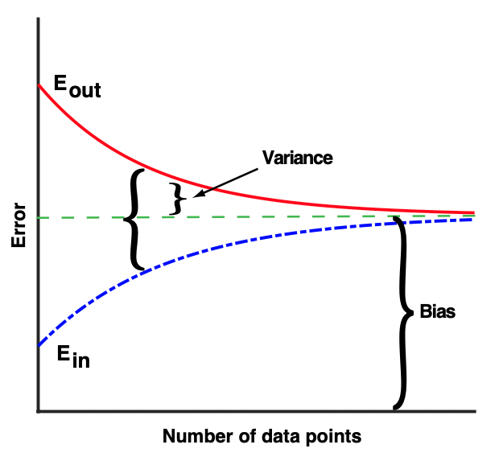
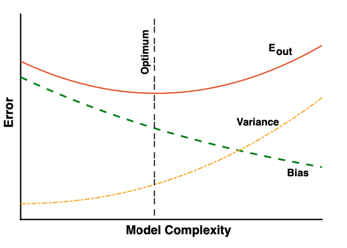
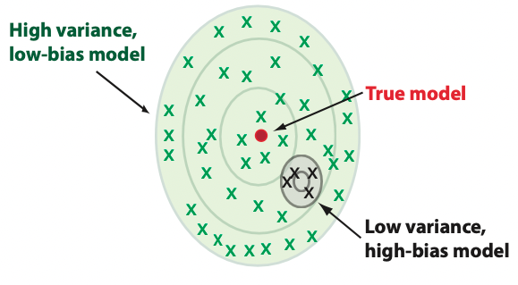
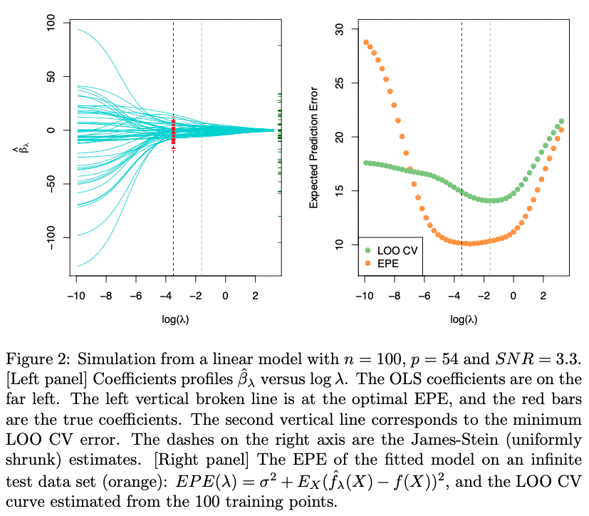

# Biais et variance de l'estimateur du paramètre d'un modèle

>- Modèle : $P(\mathbf{x};\mu,\sigma)$
>- Données observées générées (par hypothèse) par $P$ : $\mathbf{x_1}, \mathbf{x_2},\dots, \mathbf{x_n}$
>- $\hat{\mu} = E[\mathbf{x}]$ ($E$ sur \emph{tous les jeux de données possibles})
>- $\hat{\sigma}^2 = E[(\mathbf{x} - E[\mathbf{x}])(\mathbf{x} - E[\mathbf{x}])]$
>- Etant données les observations, $\hat{\mu}_{est}$ et $\hat{\sigma}_{est}$ estiment $\hat{\mu}$ et $\hat{\sigma}$
>- Estimateur non biaisé : $E[\hat{\mu}_{est}] = \hat{\mu}$ etc.
>- Variance d'un estimateur : $Var(\hat{\mu}_{est}) = E[(\hat{\mu} - \hat{\mu}_{est})^2]$

# Estimateurs par maximum de vraissemblance

$$
\begin{aligned}
 & \hat{\mu}_{ML} = \argmax_{\mu} P(\mathbf{x}; \mu, \sigma^2) \\
\Rightarrow \{& \text{A l'endroit d'un extremum, la dérivée première s'annule} \} \\
 & \partial P(\mathbf{x}; \mu, \sigma^2) / \partial \mu = 0
\end{aligned}
$$

# Exemple d'une loi normale

>-
$$
\begin{aligned}
x_i &\sim \mathcal{N}(\mu, \sigma^2) \\
P(x_i ; \mu, \sigma) &= \frac{1}{\sqrt{2\pi\sigma^2}}exp\left( -\frac{1}{2\sigma^2}(x_i-\mu)^2\right)
\end{aligned}
$$

>-
$$
\begin{aligned}
 & P(X ; \mu, \sigma) \\
= \{& \text{Hypothèse : les échantillons sont indépendants} \} \\
 & \prod_i P(x_i ; \mu, \sigma) \\
= \phantom{\{}& \\
 & (2\pi\sigma^2)^{-n/2} exp\left[ -\frac{1}{2\sigma^2} \sum_i (x_i-\mu)^2 \right]
\end{aligned}
$$

# Exemple d'une loi normale

>- $\hat{\sigma}^2_{ML}$ (aussi noté $\hat{s}_{ML}$) pour $\hat{\mu}$ connu
$$\hat{\sigma}^2_{ML} = 1/n \sum_i (x_i - \hat{\mu})^2$$

>- Estimateur non biaisé (et de variance minimale) : $E\left[ \hat{\sigma}^2_{ML} \right] = \hat{\sigma}^2$

# Exemple d'une loi normale

>- Moyenne inconnue
$$\hat{\mu}_{ML} = \frac{1}{n} \sum_i x_i$$

>- Estimateur non biaisé de la moyenne : $E[\hat{\mu}_{ML}] = \hat{\mu}$

>- Estimateur de la variance
$$\hat{s}_{ML} = n^{-1} \sum_i x_i^2 \; - \left( n^{-1} \sum_i x_i \right)^2$$

>- Estimateur biaisé (mais de variance minimale) de la variance
$$E[\hat{s}_{ML}] = \frac{n-1}{n} \hat{s}$$

>- Estimateur sans biais de la variance
$$s' \; = \;  \left( \frac{n-1}{n} \right)^{-1} \hat{s}_{ML} \; = \; \frac{1}{n-1} \sum_i (x_i - \mu)^2$$

# Analyse biais-variance pour la régression

>- $y = f(\mathbf{x}) + \epsilon$ avec $\epsilon \sim \mathcal{N}(\mathbf{0}, \sigma^2)$
>- Jeu de données $\left\{ (\mathbf{x_i}, y_i) \right\}$
>- Modèle $h(\mathbf{x})$ (e.g. linéaire : $\boldsymbol\beta^T\mathbf{x} + \beta_0$)
>- Le modèle minimise une erreur (e.g., $\sum_i \left( y_i - h(\mathbf{x_i})\right)^2$)
>- Nouveau point $\mathbf{x}^*$ associé à $y^* = f(\mathbf{x}^*) + \epsilon$
>- Quelle est $E\left[\left(y^* - h(\mathbf{x}^*)\right)^2\right]$ sur l'ensemble infini de tous les jeux de données ?

# Analyse biais-variance pour la régression

>-
$$
\begin{aligned}
E\left[ \left( h(\mathbf{x}^*) - \overline{h(\mathbf{x}^*)} \right)^2 \right] &+ \left( \overline{h(\mathbf{x}^*)} - f(\mathbf{x}^*) \right)^2 &+ \sigma^2 \\
\text{Variance} &+ \text{Biais}^2 &+ \text{Bruit}^2
\end{aligned}
$$

>- Variance : variation de $h(\mathbf{x}^*)$ d'un jeu de données à l'autre
>- Biais : erreur moyenne de $h(\mathbf{x}^*)$
>- Bruit : variation de $y^*$ par rapport à $f(\mathbf{x}^*)$

# Biais-variance et taille du jeu de données

- Pankaj Mehta \emph{et al.}, 2019 : \url{https://arxiv.org/abs/1803.08823}

```{r, out.width = "240px", echo=FALSE}

```

# Biais-variance et complexité

- Pankaj Mehta \emph{et al.}, 2019 : \url{https://arxiv.org/abs/1803.08823}

```{r, out.width = "240px", echo=FALSE}

```

# Dilemme biais-variance

- Pankaj Mehta \emph{et al.}, 2019 : \url{https://arxiv.org/abs/1803.08823}

```{r, out.width = "240px", echo=FALSE}

```

# Biais et variance des coefficients d'une régression ridge

>- Hypothèse d'un modèle génératif linéaire : $y_i = \mathbf{x_i}^T\boldsymbol\beta + \epsilon_i \quad \text{et} \quad \epsilon_i \sim \mathcal{N}(0,\sigma^2)$
>- Rappel :
$$\hat{\boldsymbol\beta}_\lambda = \sum_{d_j>0} \mathbf{v_j} \frac{d_j}{d_j^2 + \lambda} \mathbf{u_j}^T\mathbf{y}$$
>-
$$E\left[ \hat{\boldsymbol \beta}_\lambda \right] = \sum_{d_j>0} \mathbf{v_j} \frac{d_j^2}{d_j^2 + \lambda} \mathbf{v_j}^T\boldsymbol\beta$$
>- Si $\lambda=0$, $\hat{\boldsymbol\beta}$ est un estimateur sans biais ($\sum \mathbf{v_j}\mathbf{v_j}^T=\mathbf{I}_p$)
>- $\hat{\boldsymbol\beta}_\lambda$ est biaisé vers $0$ et ce d'autant plus pour les directions de faible variance

# Biais et variance des coefficients d'une régression ridge

>-
$$Var\left(\hat{\boldsymbol\beta}\right) = \sigma^2 \sum_{j=1}^{P} \frac{1}{d_j^2} \mathbf{v_j}\mathbf{v_j}^T$$
>-
$$\hat{\boldsymbol\beta} = \sum_{d_j>0} \mathbf{v_j}\frac{1}{d_j}\mathbf{u_j}^T\mathbf{y}$$
>-
$$\hat{\boldsymbol\beta}_\lambda = \sum_{d_j>0} \mathbf{v_j}\frac{d_j}{d_j^2+\lambda}\mathbf{u_j}^T\mathbf{y}$$
>-
$$\hat{\boldsymbol\beta}_\lambda = \mathbf{W} \hat{\boldsymbol\beta} \quad \text{avec } \mathbf{W} = diag\left(\frac{d_j^2}{d_j^2 + \lambda}\right)$$
>-
$$Var\left(\hat{\boldsymbol\beta}_\lambda\right) = \sigma^2 \sum_{d_j>0} \frac{d_j^2}{(d_j^2 + \lambda)^2} \mathbf{v_j}\mathbf{v_j}^T$$
>- $Var\left(\hat{\boldsymbol\beta}_\lambda\right)$ diminue uniformément quand $\lambda$ augmente

# Biais-variance régression ridge - Illustration

- Trevor Hastie, 2020 : \url{https://arxiv.org/abs/2006.00371}

```{r, out.width = "260px", echo=FALSE}

```